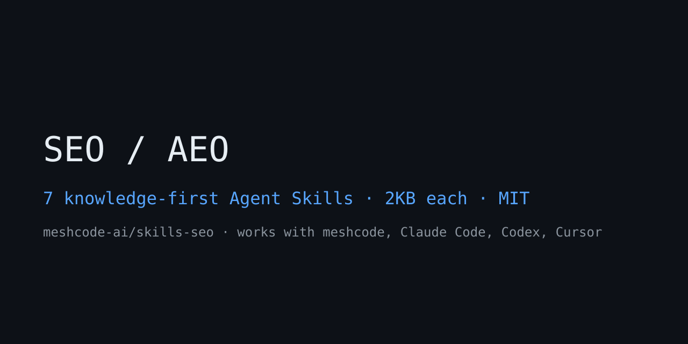

# meshcode-ai/skills-seo

7 SEO/AEO skills — knowledge-first distilled editions. Each skill consists of a trigger (description) + judgment knowledge (~2KB body) + output contract. Runs on Agent Skills standard runtimes such as meshcode desktop, Claude Code, Codex, and Cursor.

## Install

Download the zip → extract into your project's `.meshcode/skills/` (keep the flat layout). Automatically exposed from the next session onward.

## Skills

| Skill | Role |
|---|---|
| `seo-audit` | Full-site audit orchestrator (starting point) |
| `seo-technical-audit` | Crawl / index / CWV / AI crawler management |
| `seo-aeo-geo` | AI search — citability, brand mentions, per platform |
| `seo-content-eeat` | Who/How/Why, E-E-A-T, AI phrasing cleanup |
| `seo-schema` | JSON-LD detection / validation / generation |
| `seo-local` | GBP / NAP / citations / map pack |
| `seo-backlinks` | Backlink profile + competitor gaps |

## Who this is for

- **SEO agencies** — repeatable audit framework with a fixed report contract across client sites
- **In-house growth/marketing** — pre-exec-review second opinion on technical SEO, content, and AI-search readiness
- **Founders shipping their own site** — a prioritized fix list instead of a raw crawler dump

## Use with meshcode

These skills are built for [meshcode](https://meshcode.ai) (free download — macOS/Windows):

1. Open your project in meshcode
2. In chat, ask **"show available skills"**, then **"install the SEO skills"** — meshcode fetches from this repo automatically, no git or terminal needed
3. They appear in the next session and load only when a task matches, so installing all of them stays cheap

Manual alternative: download this repo's zip and extract into your project's `.meshcode/skills/`. Also works in Claude Code (`~/.claude/skills/`), Codex, and Cursor.

